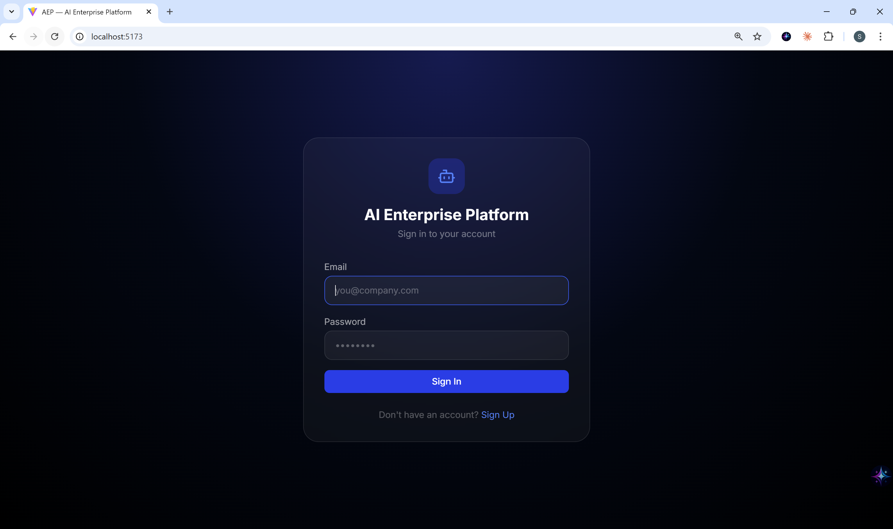
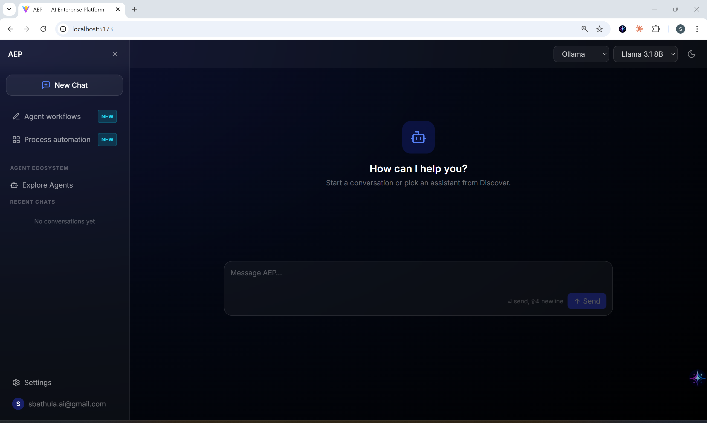
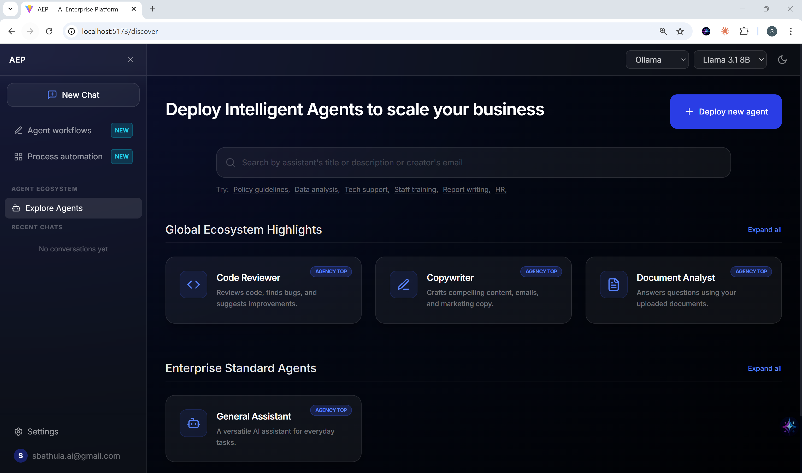

# ◈ AEP: AI Enterprise Platform

### Multi-Agent Ecosystem & Intelligent LLM Orchestration
*A production-ready, vendor-agnostic AI platform that seamlessly bridges high-tier cloud providers (OpenAI, Anthropic) with optimized local inference (Llama 3.1 8B).*

<br/>

<div align="center">


</div>

---

## 📋 Table of Contents
- [Project Objective](#-project-objective)
- [Problem Statement](#-problem-statement)
- [Key Features](#-key-features)
- [Tech Stack](#-tech-stack)
- [Project Showcase](#-project-showcase)
- [High-Level Design (HLD)](#-high-level-design-hld)
- [Project Structure](#-project-structure)
- [Step-by-Step Setup Guide](#-step-by-step-setup-guide)
- [Operations Runbook](#-operations-runbook)
- [Scalability & Production Considerations](#-scalability--production-considerations)
- [License](#-license)

---

## 🎯 Project Objective
Build a **centralized AI enterprise ecosystem** that provides:

1. **Intelligent Fallback Layer** — Automatically switches to local **Llama 3.1 8B** if cloud providers (OpenAI/Anthropic) are unavailable or hit rate limits.
2. **Cost Optimization** — Routes simple greetings and basic queries to local models to save paid credits.
3. **Agent Ecosystem (Discovery)** — A categorized marketplace for intelligent agents (Global Ecosystem & Enterprise Standards).
4. **Agent Workflows & Automation** — Specialized interfaces for complex task orchestration and process automation.
5. **Secure Multi-Tenant Auth** — Production-grade authentication using Supabase with JWKS validation.
6. **Premium Glassmorphic UI** — A state-of-the-art dark theme dashboard with neon-cyan accents and smooth animations.

---

## 🔍 Problem Statement
Scaling AI in the enterprise faces several critical bottlenecks:

```
┌─────────────────────────────────────────────────────────────────────┐
│  CLOUDS ARE EXPENSIVE, LOCAL IS FRAGMENTED, UNRELIABLE               │
│                                                                     │
│  • High latency/costs for simple tasks (OpenAI/Anthropic expensive) │
│  • No seamless failover between cloud and local models              │
│  • Fragmented agent management (No central ecosystem)               │
│  • Security gaps in session and metadata handling                   │
│                                                                     │
│  RESULT → Unpredictable operational costs                          │
│         → Downtime if a single provider's API goes down            │
│         → Poor discovery of specialized AI internal tools          │
└─────────────────────────────────────────────────────────────────────┘
```

**AEP solves this** by providing a unified gateway with built-in cost-intelligence and a robust local failover chain.

---

## ✨ Key Features

| Category | Feature | Description |
|---|---|---|
| 🧠 **LLM Mastery** | Smart Provider Routing | Dynamic switching between OpenAI, Anthropic, and Local Ollama |
| 🛡 **Reliability** | Local Failover Chain | Zero-downtime failover to Llama 3.1 8B on model errors |
| 💰 **Efficiency** | Cost-Aware Ingestion | sub-10ms query analysis to route greetings to local free models |
| 🌍 **Ecosystem** | Global Agent Discovery | Categorized marketplace for deploying specialized agents |
| ⚡ **Workflows** | Agentic Automation | Dedicated modules for "Agent Workflows" and "Process Automation" |
| 🔐 **Security** | Supabase Enterprise | RSA256 JWT validation via JWKS, secure metadata storage |
| 📊 **Dashboard** | Cyan Neon UI | Dark glassmorphic design system with Framer Motion animations |

---

## �️ Project Showcase

<div align="center">

### Enterprise Authentication Hub

*Secure, high-end login interface with Supabase Auth integration.*

<br/>

### Intelligent Chat Ecosystem

*Dark glassmorphic chat interface with real-time streaming and local fallback indicators.*

<br/>

### Global Agent Ecosystem

*Categorized agent marketplace (Ecosystem Highlights & Enterprise Standards) with smart search suggestions.*

</div>

---

## �🛠 Tech Stack

### Application Layer
| Component | Technology | Version | Purpose |
|---|---|---|---|
| **Frontend** | React 18 | 18.3.x | Component-based Dashboard UI |
| **Build Tool** | Vite | 5.x | High-performance dev server |
| **Styling** | Vanilla CSS | — | Custom Cyan Neon Design System |
| **Animation** | Framer Motion | 11.x | Fluid UI transitions & motion elements |
| **State** | Zustand | 4.x | Lightweight global state management |
| **Backend** | FastAPI | 0.110.x | Async Python REST API |
| **Orchestration**| LangGraph | 0.0.x | Agentic state machines & self-correction |
| **LLM Framework**| LangChain | 0.1.x | Unified interface for 3+ LLM providers |

### Infrastructure Layer (Production Reference)
| Component | Technology | Purpose |
|---|---|---|
| **Local Inference** | Ollama | Serving Llama 3.1 8B locally |
| **Identity** | Supabase Auth | Enterprise JWT authentication |
| **Database** | PostgreSQL | Persistence for chats, agents, and metadata |
| **Vector DB** | pgvector | Storing RAG context and agent embeddings |
| **Container** | Docker | Full-stack containerization |

---

## 🏗 High-Level Design (HLD)

```
                        ┌─────────────────────────────────────────┐
                        │        USER INTERFACE (React 18)         │
                        │  Explore Agents · Workflows · Auto      │
                        │  Streaming Chat · Settings · Auth       │
                        └───────────────────┬─────────────────────┘
                                            │
                             WebSocket · REST · Supabase Auth
                                            │
                ╔═══════════════════════════════════════════════════════╗
                ║              INTELLIGENT GATEWAY (Layer 1)            ║
                ║  ┌──────────┐  ┌──────────────┐  ┌──────────────┐    ║
                ║  │Cost      │→ │ Smart        │→ │ Provider     │    ║
                ║  │Optimizer │  │ Router       │  │ Fallback     │    ║
                ║  └──────────┘  └──────────────┘  └──────┬───────┘    ║
                ╚═════════════════════════════════════════╪═════════════╝
                                                          │
                     ┌────────────────────────────────────┼──────────┐
                     │                                    │          │
                     ▼                                    ▼          ▼
        ╔═══════════════════════╗   ╔══════════════════════════════════╗
        ║   LOCAL AI CLUSTER    ║   ║   CLOUD AI ORCHESTRATOR (L2)     ║
        ║                       ║   ║                                  ║
        ║  Ollama (Llama 3.1 8B)║◄──║  ┌─────────────────────────┐    ║
        ║  Vector Store (PGV)   ║   ║  │ LangGraph Agent Flow    │    ║
        ║                       ║   ║  │ (Self-Correction Loop)  │    ║
        ║                       ║   ║  └────────────┬────────────┘    ║
        ╚═══════════════════════╝   ║               │                 ║
                     │              ║  ┌────────────▼────────────┐    ║
                     │              ║  │ Discovery Service        │    ║
                     │              ║  │ Agent Ecosystem Engine   │    ║
                     │              ║  └────────────┬────────────┘    ║
                     │              ║               │                 ║
                     │              ║  ┌────────────▼────────────┐    ║
                     │              ║  │ RAG Vector Engine        │    ║
                     │              ║  │ Knowledge Contextualizer │    ║
                     │              ║  └─────────────────────────┘    ║
                     │              ╚══════════════╤═══════════════════╝
                     │                             │
            ┌────────┼─────────────────────────────┼──────────┐
            │        │                             │          │
            ▼        ▼                             ▼          ▼
  ╔══════════════════════╗           ╔══════════════════════════════╗
  ║    PERSISTENCE (L3)  ║           ║       AUTH & SECURITY (L4)    ║
  ║                      ║           ║                              ║
  ║  PostgreSQL (Supabase)║◄─────────►║  Supabase Auth (JWT)         ║
  ║  Metadata · Sessions ║           ║  JWKS Validation              ║
  ║  Agent Configurations║           ║  Provider API Key Vault       ║
  ╚══════════════════════╝           ╚══════════════════════════════╝
```

---

## 📁 Project Structure

```
AI_EnterprisePlatform/
│
├── 📂 backend/                        # Python FastAPI Backend
│   ├── 📂 app/
│   │   ├── 📂 agents/                 # LangGraph & Agent logic
│   │   ├── 📂 routers/                # API Endpoints (Chat, Agents, Auth)
│   │   ├── 📂 services/               # LLM Provider & Fallback logic
│   │   ├── 📂 models/                 # DB Schemas & Metadata
│   │   └── main.py                    # Entry point
│   ├── Dockerfile                     # Backend containerization
│   └── requirements.txt               # Dependencies
│
├── 📂 frontend/                       # React 18 + Vite Frontend
│   ├── 📂 src/
│   │   ├── 📂 components/             # Reusable UI (Sidebar, Header)
│   │   ├── 📂 pages/                  # Discover, Chat, Settings
│   │   ├── 📂 store/                  # Zustand state (UI, Chat)
│   │   └── App.tsx                    # Main Routing
│   ├── index.css                      # Cyan Neon Design System
│   └── vite.config.ts                 # Configuration
│
├── docker-compose.yml                 # Full-stack orchestration
└── .env                               # Secrets & API Keys
```

---

## 🚀 Step-by-Step Setup Guide

### Prerequisites
*   **Python**: 3.10+
*   **Node.js**: 18+
*   **Docker**: For full-stack orchestration
*   **Ollama**: Install and pull `llama3.1:8b` for local failover.

### Step 1: Environment Setup
Clone the repo and create a `.env` file from the template:
```bash
cp .env.example .env
# Update your SUPABASE_URL, SUPABASE_ANON_KEY, and API keys
```

### Step 2: Backend Installation
```bash
cd backend
pip install -r requirements.txt
python -m app.main
```

### Step 3: Frontend Installation
```bash
cd frontend
npm install
npm run dev
```

### Step 4: Local AI (Optional but Recommended)
Install Ollama and pull the failover model:
```bash
ollama serve
ollama pull llama3.1:8b
```

---

## 📘 Operations Runbook

### 🟢 Startup Procedure
1. Verify Ollama is running (`ollama list`).
2. Start the Backend API (Port 8000).
3. Start the Frontend Dashboard (Port 5173).

### 🔄 Failover Verification
To test failover, temporarily disable your Internet or provide an invalid OpenAI key. The platform will automatically route all queries to the local **Llama 3.1 8B** instance.

### 🔐 Security Considerations
*   All requests are validated via RSA public keys (JWKS) from Supabase.
*   Cross-Origin Resource Sharing (CORS) is restricted to local/production domains.

---

## 📄 License
This project is licensed under the MIT License - see the LICENSE file for details.
